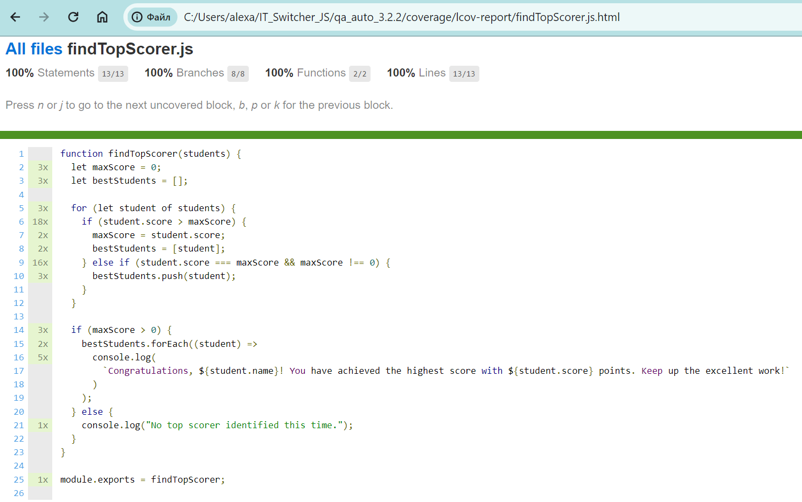

# qa_auto_3.2.2

## Table of contents
- [Description](#description-)
- [Installation](#installation-)
- [Setup](#setup-)
- [Running tests](#running-tests-)
- [Coverage measurement](#coverage-measurement-)

## Description 📝

This project contains the `findTopScorer` JavaScript function. It analyzes student scores and identifies the top performers, congratulating them with personalized messages. The function is designed to iterate through an array of student objects, identify the highest score, and output congratulatory messages to all students who achieved that score. If there are no scores above zero, it notifies that no top scorer was identified this time.

This project is part of the homework assignments for Module 3 "Unit Tests" of a course on JavaScript test automation.

## Installation 🛠️

1. **Clone this repository**

   To clone this repository, run the following command in your terminal:

   ```
   git clone https://github.com/shinkai-tester/qa_auto_3.2.2.git
   ```

2. **Navigate to the project directory**

## Setup 🚀

**Install dependencies:**
- Ensure that Node.js is installed on your machine. If not, download and install it from [Node.js official website](https://nodejs.org/).
- Install all required dependencies by running:

```
npm install
```

## Running Tests 🧪

Test the functionality of the `findTopScorer` function with:

```
npm install
```

OR

```
npx jest
```


## Coverage measurement 📊




Coverage measurement in testing evaluates how much of your code is executed while the tests run. Here's what each metric means:

- **Lines**: % of code lines executed during the tests;
- **Functions**: % of functions that are called during the tests;
- **Branches**: % of conditional code branches (like in `if` statements) that are executed.

### Running coverage

To generate a coverage report, `--coverage` flag can be added to Jest test command:

```
npx jest --coverage
```

Alternatively, since `"test:coverage": "jest --coverage"` is configured in `package.json`, you can also run the coverage using:

```
npm run test:coverage
```